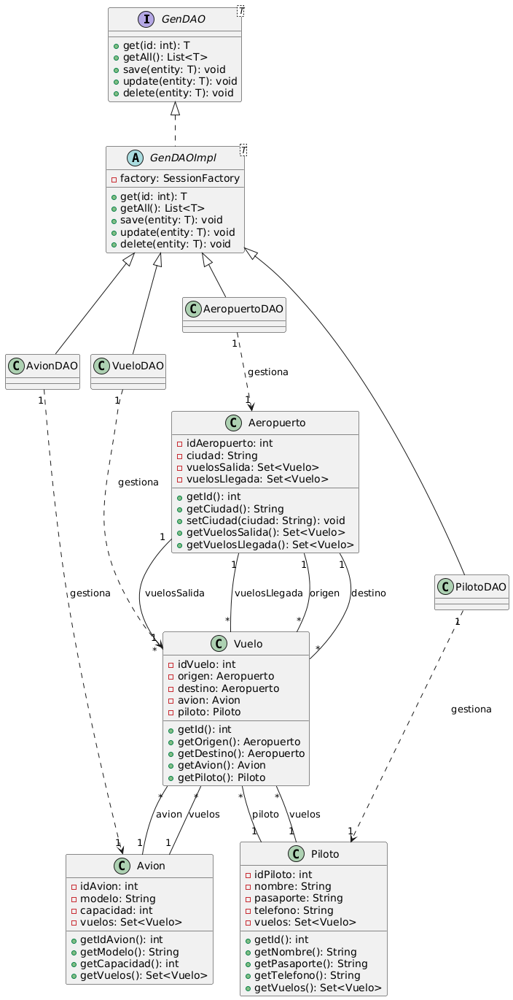

# M06-UF4-A01

### 1. De quina lògica d’aplicació s’encarrega el Patró DAO?

El patró DAO s'encarrega de tota la lògica d'interacció amb la base de dades de cadascuna de les classes.

### 2. Per què considereu que és útil el patró DAO i en què us ha servit?

El patró DAO és útil perquè permet una millor organització del codi, permetent gestionar totes les classes des dels mateixos mètodes, aconseguint un codi més curt, senzill i fàcil de llegir.

### 3. Heu hagut de fer cap ajust al vostre codi d’aplicació (Main, Controladors, Vistes, altres classes que no siguin DAO, etc.)? Si és així, detalleu breument quins canvis heu fet i per què.

No, ja que la major part del meu codi per gestionar la lògica de la base de dades ja era gestionada per les classes DAO.

### 4. D’igual forma que s’ha fet a l’enunciat, completeu el diagrama de classes de l’activitat A01 de la UF2 incorporant les interfícies, la classe abstracta i els DAOs. Per acoblar això, cal que relacioneu cada classe del model amb el seu DAO (només aquelles classes que heu treballat a l’A03, no totes!):

### 5. Per últim, valoreu el paper que hi juga la classe abstracta. És en tots els casos necessària? En el cas de l’activitat A02 de la UF2, on vau emprar JDBC, penseu que seria d’utilitat?

La classe abstracta ha estat molt important, ja que contenia totes les accions del CRUD, adaptant-les per ser usables per totes les altres classes DAO. No és necessària en tots els casos, ja que, per exemple, en l’activitat A02 de la UF2, en interactuar només amb una taula, no hauria tingut tanta utilitat.